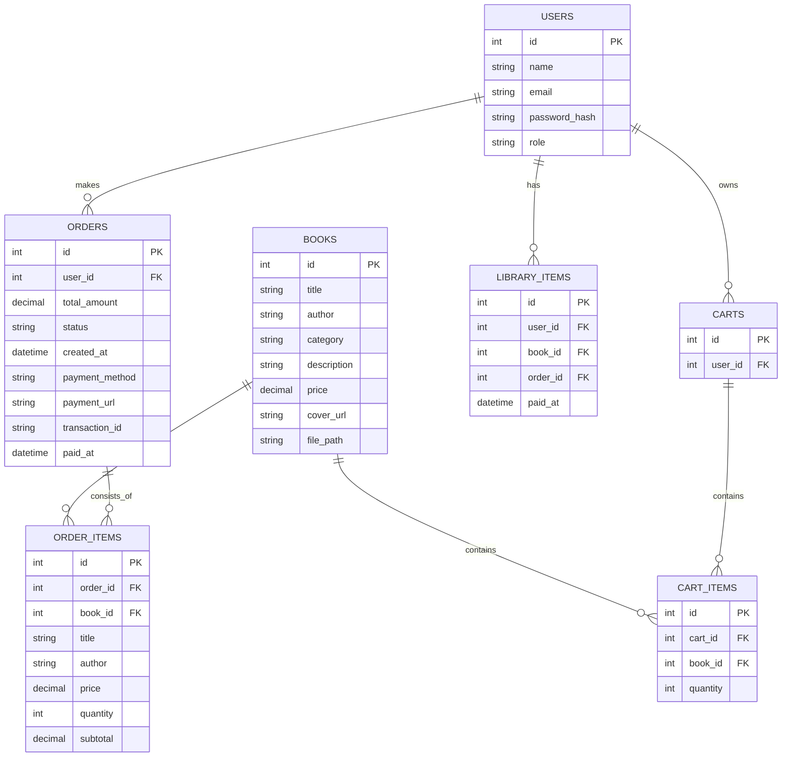

# ERD Bukuin

Berikut adalah diagram ERD untuk project Bukuin menggunakan Mermaid.

## Penjelasan singkat

- `users` menyimpan data pengguna dan role (admin/user).
- `books` menyimpan katalog buku, termasuk cover dan file ebook.
- `carts` dan `cart_items` menyimpan keranjang belanja user.
- `orders` menyimpan transaksi pesanan.
- `order_items` menyimpan detail item per order.
- `library_items` menyimpan kumpulan ebook yang sudah dibeli oleh user.

## Catatan

- Status order biasanya bernilai: `pending`, `paid`, `cancelled`, `refunded`.
- `library_items` dipakai untuk fitur My Library agar user bisa membuka ebook yang telah dibeli.
